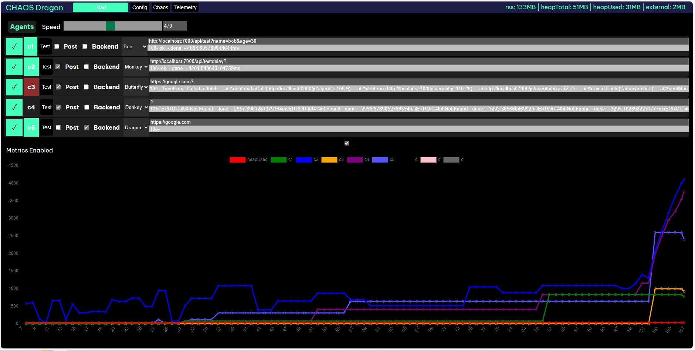

# Chaos Dragon
## A chaos engineering tool that introduces measured instability and load to help engineers create more robust systems

Creates a set of chaos agents with differeing archetypes. Each chaos agent tests an API or service.

## setup
edit config.json  
npm run start  
open the gui: localhost:7000  

### TODO:
1. First definte steady state, use metric snapshot
    1. compare results to steady state
2. Introduce sudden chaos
3. Introduce rising chaos
4. define a blast radius

## Types of Chaos Agents:
1. bee - little jabs of chaos
2. monkey - provides utter chaos, with delayed responses
3. butterfly - light chaos
4. donkey - bursty, periodic kicks of chaos
5. dragon - constant chaos
